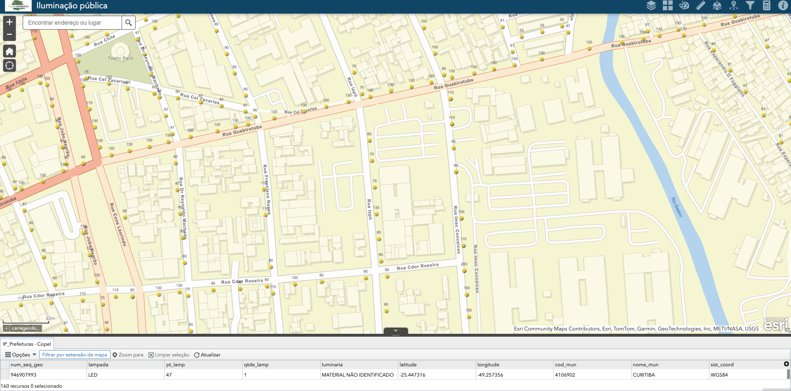

# Research Project: Quantum Optimization for LED Retrofitting (ENBPar)

**Scientific Initiation Research (PIBIC) - PUCPR**
**Student:** David Bobato Kikina | **Advisors:** Profs. Jonas Krause and Rodrigo Pasti

## Overview
This repository contains the algorithms and technical documentation for the development of a Quantum Combinatorial Optimization model. The objective is to create a system capable of intelligent planning (retrofitting) for ENBPar's public lighting infrastructure, utilizing the **Quantum Approximate Optimization Algorithm (QAOA)** to solve large-scale logistical bottlenecks that are intractable for classical computing.

At its core, the retrofitting problem is mapped onto a **Maximal Independent Set (MIS)** problem: each streetlight is a node in a graph, and an edge is drawn between two nodes whenever they are close enough to cause redundant/overlapping illumination. Solving for the MIS of this graph yields the largest possible subset of streetlights that can be kept active with zero spatial conflict between them — maximizing coverage while eliminating redundancy.

---

## Project Architecture
```text
├── data/
│   └── paranainterativo.csv         # Real-world IPPUC dataset (GPS coordinates)
├── src/                             
│   ├── core/                        # Quantum simulation and math logic (QUBO, Hamiltonians)
│   │   ├── optimizers/              # Hill Climbing, Simulated Annealing.. algorithms
│   │   └── ...                      # (quantum_physics, lattice_model, real_graph_qubo..)
│   ├── data/                        
│   │   └── paranainterativo.csv     # Real-world IPPUC dataset (GPS coordinates)
│   ├── visualization/               # Scripts to plot convergence graphs and maps
│   ├── results/                     # Generated outputs (CSVs, TXTs, and PNG graphs)
│   └── main.py                      # Main entry point of the application
├── tests/
│   └── test_quantum_lattice.py      # Unit test suite for lattice structures
├── .gitignore
└── README.md
```

---

## Technical Guide: Parameter Tuning & Experimentation

You can tweak parameters in the source code to change how the AI and the quantum physics behave.

### 1. QUBO Hamiltonian Calibration
The objective function balances rewards and penalties:

$$C(x) = -\alpha \sum_i x_i + \beta \sum_{(i,j) \in E} x_i x_j$$

* `ALPHA_COVERAGE`: The reward for turning a streetlight ON.
* `BETA_REDUNDANCY`: The penalty applied when two conflicting streetlights are ON at the same time. The penalty must be strictly higher than the reward to enforce the MIS constraint.

### 2. Topological Graph Generation
* The project uses Haversine distance calculations to extract real geographic data.
* led_radius_meters: Defines the physical coverage radius of a streetlight. This sets the conflict threshold between nodes.

### 3. Optimization Engines 
The AI uses hybrid classical-quantum approaches to minimize the Ising energy:

* Simulated Annealing: Uses a cooling schedule and thermodynamic probability ($\exp(-\Delta E / T)$) to escape local minima.  
* Shot-Noise Tolerance (epsilon): A filter used to differentiate real energy improvements from the statistical variance of the quantum simulator.

---

## How to Run the Pipeline
Ensure you run these commands from the **root directory** of the pro

1. Run the main simulation: python src/main.py
2. Plot Algorithmic Convergence: python src/visualization/plot_convergence.py
3. Plot Geographic Map: python src/visualization/plot_mis_map.py

---

## Real-World Data Extraction (Prado Velho / PUCPR)

*Fonte: [Portal Paraná Interativo - Governo do Estado do Paraná](https://paranainterativo.pr.gov.br/portal/apps/webappviewer/index.html?id=f282d1c181c0405789e2f65c17ac274d)*